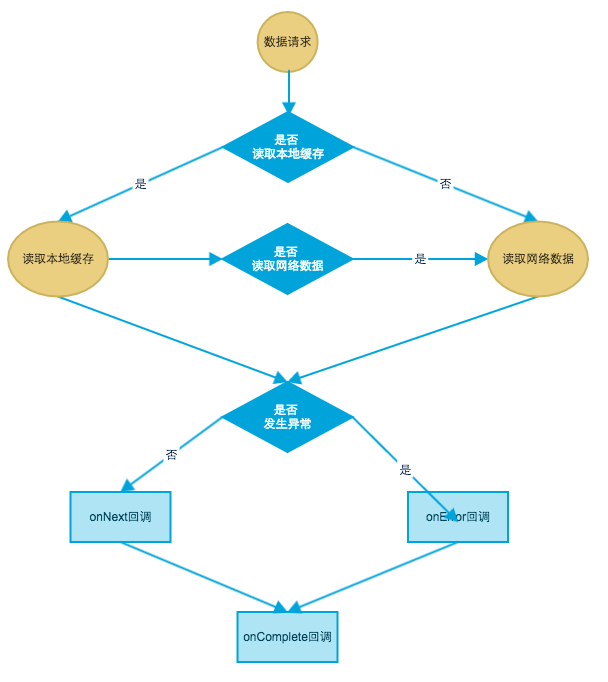

## Integration
``` xml

dependencies {
    compile 'com.cabe.lib:RxCache:0.1 beta'
}

``` 

## Init config
```java

        StringHttpFactory.logLevel = RestAdapter.LogLevel.NONE;
        DiskCacheManager.DISK_CACHE_PATH = getExternalCacheDir() + File.separator + "data";
        
```

## Usage
```java

        RequestParams params = new RequestParams();
        params.host = "https://www.github.com";
        params.path = "crabfang/RxCache";

        AbstractCacheUseCase<GitHubBean> useCase = new SimpleCacheUseCase<>(new TypeToken<GitHubBean>(){}, params);
        useCase.execute(new ViewPresenter<GitHubBean>() {
            @Override
            public void error(CacheSource from, int code, String info) {
            }
            @Override
            public void load(CacheSource from, GitHubBean data) {
            }
            @Override
            public void complete(CacheSource from) {
            }
        });
        
```

## Base Class
### Disk Cache Interface
```java

        public interface DiskCacheRepository {
            <T> boolean exits(TypeToken<T> typeToken);
            <T> T get(TypeToken<T> typeToken);
            <T> boolean put(TypeToken<T> typeToken, T data);
        }

```

### Http Cache Interface
```java

        public interface HttpCacheRepository<T> {
            Observable<T> getHttpObservable(RequestParams params);
            HttpTransformer<T> getResponseTransformer();
        }

```

### Abstrace Cache UseCase
```java

        public abstract class AbstractCacheUseCase<T> extends UseCase<T> {
            private boolean diskOnly = false;
        
            public AbstractCacheUseCase(TypeToken<T> typeT) {
                super(typeT);
            }
        
            public void setDiskOnly(boolean diskOnly) {
                this.diskOnly = diskOnly;
            }
        
            public boolean isDiskOnly() {
                return diskOnly;
            }
        
            @Override
            public Observable<T> buildUseCaseObservable() {
                return buildDiskObservable();
            }
        
            public abstract Observable<T> buildDiskObservable();
        
            public abstract Observable<T> buildHttpObservable();
        
            protected abstract Subscriber<T> getSubscriber(CacheSource from, ViewPresenter<T> presenter);
        
            public void execute(final ViewPresenter<T> presenter) {
                super.execute(getSubscriber(CacheSource.DISK, presenter));
            }
        
            protected void executeHttp(final ViewPresenter<T> presenter) {
                new UseCase<T>(getTypeToken()){
                    @Override
                    public Observable<T> buildUseCaseObservable() {
                        return buildHttpObservable();
                    }
                }.execute(getSubscriber(CacheSource.HTTP, presenter));
            }
        }
```

## Implements

    create a class DiskCacheManager implements DiskCacheRepository;
    create a class HttpCacheManager implements HttpCacheRepository;
    create a class SimpleCacheUseCase extends AbstractCacheUseCase;